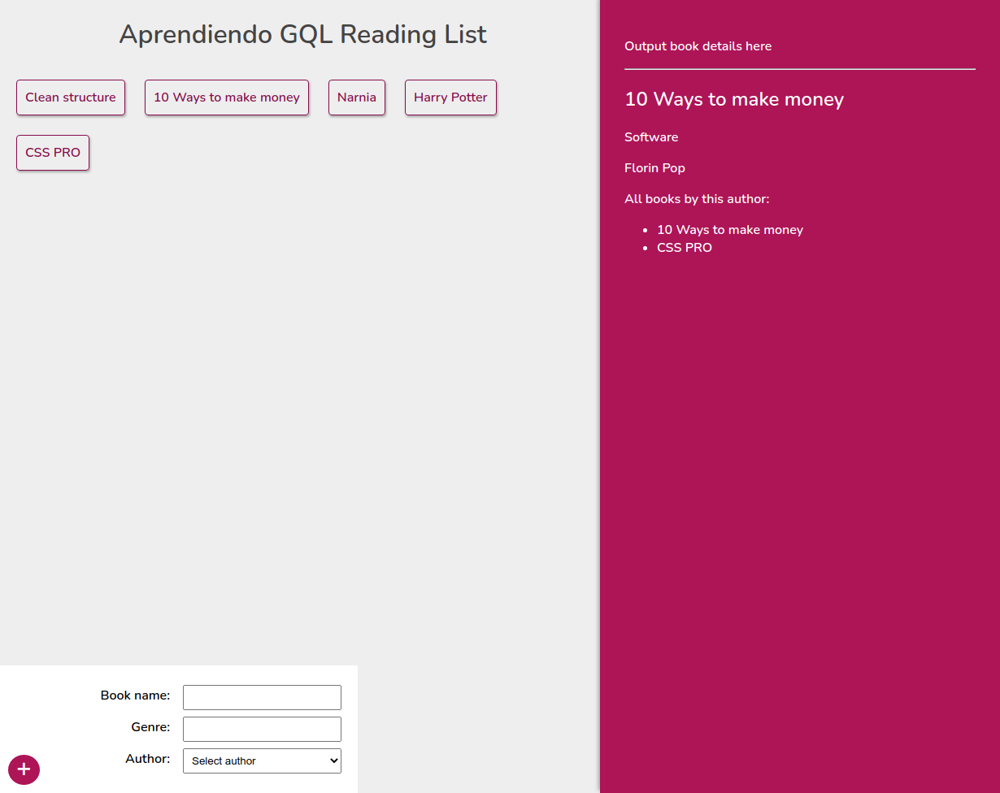

# App sencillo con consultas graphql

Desarrollado:

- Backend:

  NodeJs, Express, GraphQl

- Frontend:

  Reactjs, Apollo client, GraphQl



Para instalar aplicacion ejecutar:

```
cd server && npm install
cd client && npm install
```

Para iniciar aplicacion ejecutar

```
cd server && node app
cd client && npm start
```

------

Referencia de proyecto:

[The net ninja!](https://www.youtube.com/channel/UCW5YeuERMmlnqo4oq8vwUpg)